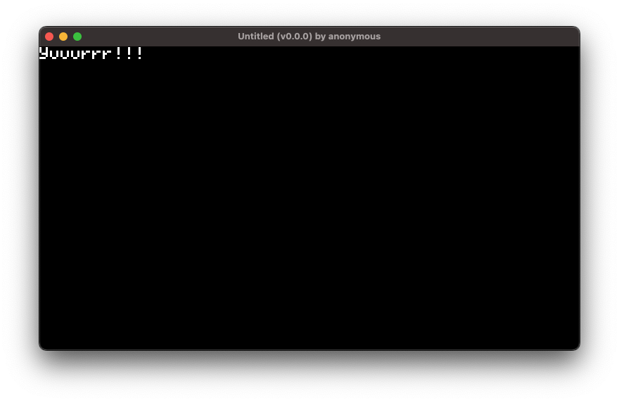

import Tabs from '@theme/Tabs';
import TabItem from '@theme/TabItem';
import Admonition from '@theme/Admonition';

# Quick Start


<br />
<br />

## Installation

<Tabs>
    <TabItem value="MacOS_Linux" label="MacOS / Linux" default>

        1. **Install [Rust](https://www.rust-lang.org/)**.

        ```sh
        curl --proto '=https' --tlsv1.2 -sSf https://sh.rustup.rs | sh
        ```

        2. **Add the Rust WebAssembly compiler target**
        ```
        rustup target add wasm32-unknown-unknown
        ```

        3. **Run the Turbo CLI install script**

        ```bash
        curl -sSfL https://turbo.computer/install.sh | sh
        ```


        <Admonition type="note">
            The installer will ask for your password for permission to move the `turbo` command into `/usr/local/bin`. If you prefer a manual download, follow these steps:
            1. Download the 64-bit release for your platform on the [releases page](https://github.com/super-turbo-society/turbo-cli/releases/0.7.0).
            2. Decompress the archive and move `turbo` into your `$PATH`. We recommend `/usr/local/bin`.
        </Admonition>

        4. **Verify your installation**

        ```bash
        turbo -h
        ```

        If successful, it will output `turbo`'s help documentation 🎉

    </TabItem>

    <TabItem value="Windows" label="Windows">

        1. **Install [Git for Windows](https://git-scm.com/download/win).**

        We will use **Git Bash** to run the commands in subsequent steps.

        2. **Install [Rust](https://www.rust-lang.org/)**

        Download and run [rustup-init.exe](https://static.rust-lang.org/rustup/dist/x86_64-pc-windows-gnu/rustup-init.exe).

        3. **Add the Rust WebAssembly compiler target**

        ```
        rustup target add wasm32-unknown-unknown
        ```

        4. **Run the Turbo CLI install script**

        **Run Git Bash as an administrator** and enter the following command:

        ```bash
        curl -sSfL https://turbo.computer/install.sh | sh
        ```

        <Admonition type="note">
            If you prefer a manual download, follow these steps:
            1. Download the 64-bit release for [Windows MSVC](https://github.com/super-turbo-society/turbo-cli/releases/download/0.7.0/turbo-0.7.0-x86_64-pc-windows-msvc.zip).
            2.  Unzip the file and move `turbo.exe` into `C:\Windows\System32`.
        </Admonition>

        5. **Verify your installation**

        ```bash
        turbo -h
        ```

        If successful, it will output `turbo`'s help documentation 🎉
    </TabItem>

</Tabs>

---

## Hello, World!

Now it is time to speedrun your first Turbo game. It should take less than 5 minutes.

### 1. Initialize

Begin by creating a new project called `hello-world`:

```
turbo init hello-world
```

This initializes a rust crate in a `hello-world` directory.

### 2. Run

Next, run your game with the following command:

```
turbo run -w hello-world
```

A game window should appear.


:::note

The `-w` flag auto-refreshes your game window as you code. Just be sure to watch the console for compiler errors.

:::

### 3. Update

Leave the `turbo run` command running. Open the `hello-world` project in your preferred editor.

Now, open `hello-world/src/lib.rs`. You should see something like this:

```rust title="hello-world/src/lib.rs" showLineNumbers
// This is where your main game loop code goes
// The stuff in this block will run ~60x per sec
turbo::go!({
    text!("Hello, world!!!");
});
```

Time for your first update. Modify the text and check out your game window:

```rust title="hello-world/src/lib.rs" showLineNumbers
// This is where your main game loop code goes
// The stuff in this block will run ~60x per sec
turbo::go!({
    // highlight-start
    text!("Yuuurrr!");
    // highlight-end
});
```



If you want to keep playing around, the `text!` macro has several optional parameters you can experiment with:

```rust title="hello-world/src/lib.rs" showLineNumbers
// This is where your main game loop code goes
// The stuff in this block will run ~60x per sec
turbo::go!({
    // highlight-start
    text!(
        "Let's gooo!",      // Text to display
        x = 32,             // Starting x position of the text
        y = 48,             // Starting y position of the text
        color = 0xff00ffff, // Text color
        font = "large"      // Text font (other options: "small", "medium")
    );
    // highlight-end
});
```

## Next Steps

Congratulations! 🎉

Here are a few ways to continue your game development journey:

- [Join the Discord community &rarr;](https://discord.gg/Xb3tgSZGgD)
- [Get comfy with a tutorial that covers the basics &rarr;](/tutorials)
- [Browse through the Rust SDK reference &rarr;](/rust-sdk/getting-started)
- [See our "How To" section to quickly learn new concepts &rarr;](/how-to)
- [Explore the possibilities in our demo games repo &rarr;](https://github.com/super-turbo-society/turbo-demos/tree/main?tab=readme-ov-file#-turbo-demo-games)

<br />
